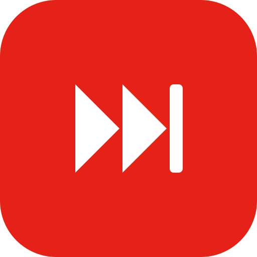

<div align="center">
  
  <h1>Skip Ad</h1>
  <p>App Android que pula os anúncios do YouTube automaticamente.</p>
</div>

---

Um `AccessibilityService` leve que detecta o botão **"Pular anúncios"** do YouTube assim que ele aparece e clica sozinho. Roda em segundo plano, reage a eventos (sem polling), **não usa internet e não pede nenhuma permissão perigosa**.

## Como funciona

O serviço escuta apenas eventos do pacote do YouTube (`com.google.android.youtube`). Quando a tela muda, ele procura o botão de pular por:

1. **ID conhecido** do botão (`skip_ad_button` e variações);
2. **Texto/descrição** de fallback ("Pular anúncios", "Skip Ad", etc.).

Ao achar, sobe até o ancestral clicável e executa `ACTION_CLICK`, com um cooldown curto para evitar cliques repetidos.

> Só age quando existe o botão "Pular". Anúncios não-puláveis não têm como ser removidos por acessibilidade.

## Requisitos

- Android 7.0+ (minSdk 24)
- SDK Android com `build-tools`, `platform-tools` e uma `platform` instalada
- JDK 17

## Compilar

O build é feito **sem Gradle**, direto com `aapt2`, `d8` e `apksigner`:

```bash
export ANDROID_HOME=~/Android/Sdk
./build.sh
# gera ./skipad.apk
```

## Instalar

```bash
adb install -r -g skipad.apk
```

Depois ative em **Configurações → Acessibilidade → Skip Ad**. No Android 13+ pode ser
necessário liberar "configurações restritas" no *App info* do app (por ser instalado fora da Play Store).

Para ativar direto via adb (útil em testes):

```bash
adb shell settings put secure enabled_accessibility_services \
  com.valb.skipad/com.valb.skipad.SkipAdService
adb shell settings put secure accessibility_enabled 1
```

## Estrutura

```
AndroidManifest.xml
build.sh                         # pipeline de build sem Gradle
art/logo.svg                     # logo (fonte)
res/                             # ícones + config do serviço + strings
src/com/valb/skipad/
  ├── SkipAdService.java         # detecção e clique
  └── MainActivity.java          # tela que abre a Acessibilidade
```

## Privacidade

Sem permissões de rede, sem coleta de dados, sem telemetria. O único acesso é o de
Acessibilidade, restrito ao pacote do YouTube.

## Licença

MIT — veja [LICENSE](LICENSE).
